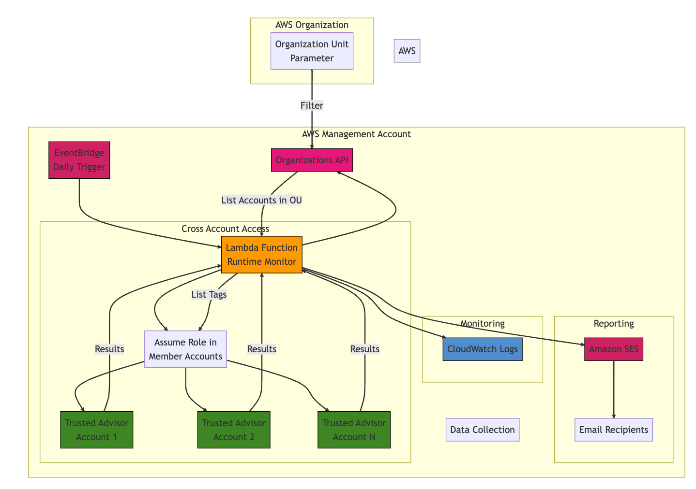

# Lambda Runtime Monitor
A centralized solution to monitor and report deprecated Lambda runtimes across multiple AWS accounts within specific Organization Units.

## Architecture


## Features

- Automatic account discovery within specified OU
- Cross-account access using IAM roles
- 🔍 Daily automated scanning of Lambda functions
- 📊 Identifies functions using deprecated runtimes
- 🏷️ Includes APPID tag information (optional)
- 📧 Email notifications with detailed reports
- ⏱️ Configurable scheduling
- 📝 Comprehensive logging via CloudWatch

## Prerequisites

- AWS Organizations setup
- Management account with:
- Organizations API access
- AWS Account with Business or Enterprise Support (for Trusted Advisor API access)
- Verified email address in Amazon SES
- AWS CLI installed and configured
- Required IAM permissions to deploy CloudFormation stacks

## Quick Start

1. **Verify SES Email**
```bash
aws ses verify-email-identity --email-address your-sender@example.com
```

2. **Deploy Stack**
```bash
aws cloudformation create-stack \
  --stack-name deprecated-runtime-checker \
  --template-body file://cloudformation/deprecated-runtime-notification-system.yml \
  --capabilities CAPABILITY_IAM \
  --parameters \
    ParameterKey=EmailRecipient,ParameterValue=recipient@example.com \
    ParameterKey=EmailSender,ParameterValue=sender@example.com
```

## Configuration Parameters

| Parameter | Description | Default |
|-----------|------------|---------|
| OrganizationUnitId | ID of the Organization Unit to monitor | - |
| EmailRecipient | Email address to receive notifications | - |
| EmailSender | Verified SES email address to send from | - |
| CrossAccountRoleName | Name of the IAM role in member accounts | LambdaRuntimeMonitorRole |


## Email Report Format

The daily email report includes:
- Account ID
- Function Name
- Runtime Version
- AWS Region
- Status
- APPID Tag (if enabled)

## Enabling APPID Tag Checking

To enable APPID tag checking:
1. Open the Lambda function code in the CloudFormation template
2. Uncomment the tag checking code block
3. Deploy or update the stack

## IAM Permissions

The solution creates an IAM role with the following permissions:
- `support:DescribeTrustedAdvisorCheckResult`
- `ses:SendEmail`
- `ses:SendRawEmail`
- `lambda:ListTags`
- `sts:GetCallerIdentity`
- CloudWatch Logs permissions

## Monitoring and Logging

- All function executions are logged to CloudWatch Logs
- Stack creation events are available in CloudFormation console
- Email delivery status can be monitored in SES console

## Troubleshooting

Common issues and solutions:

1. **Email not received**
   - Verify SES email address
   - Check SES sending limits
   - Review CloudWatch Logs

2. **Function execution failed**
   - Verify AWS Support plan level
   - Check IAM permissions
   - Review CloudWatch Logs

3. **Missing APPID tags**
   - Confirm tag checking code is uncommented
   - Verify IAM permissions for tag access

4. Cross-Account Access
```bash
# Verify role in member account
aws iam get-role --role-name LambdaRuntimeMonitorRole --profile member-account
```

5. Email Delivery
```bash
# Check SES verification status
aws ses get-identity-verification-attributes \
  --identities your-sender@example.com
```

6. Organizations Access
```bash
# Verify OU access
aws organizations list-accounts-for-parent \
  --parent-id ou-xxxx-xxxxxxxx
```

## Cost Considerations

- Lambda invocation (1 daily)
- CloudWatch Logs storage
- SES email sending
- Trusted Advisor API calls

## Security Considerations

- Email addresses should be verified in SES
- IAM roles follow least privilege principle
- All actions are logged to CloudWatch
- No sensitive data is stored

## Contributing

1. Fork the repository
2. Create a feature branch
3. Commit changes
4. Submit pull request

## License

This project is licensed under the MIT License - see the LICENSE file for details.

---

**Note**: This system requires AWS Business or Enterprise Support for Trusted Advisor API access.
